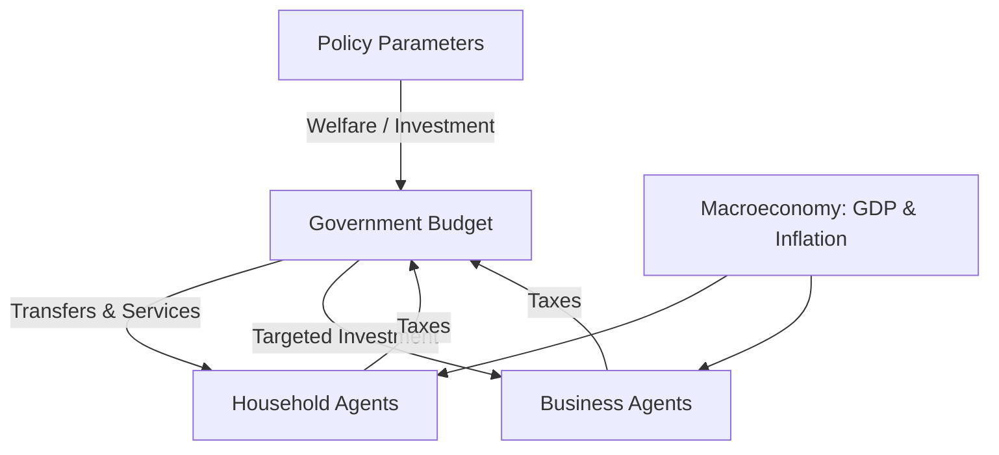
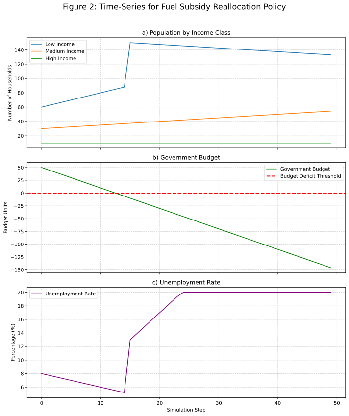
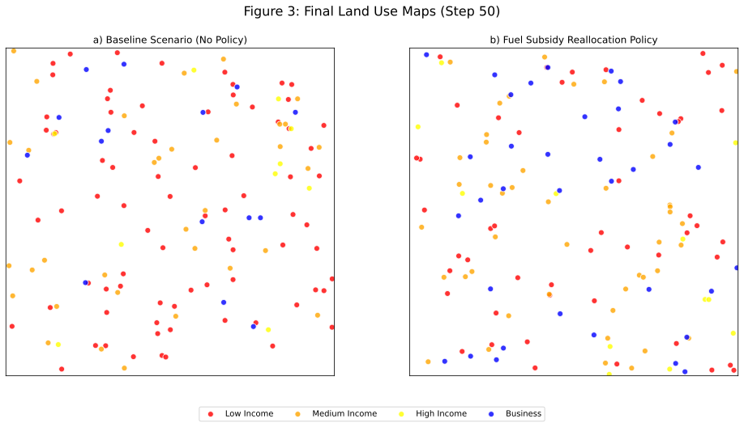

## 1. Introduction

Nigeria, as Africa’s largest economy and most populous nation, confronts a unique and complex set of policy challenges. These include managing rapid population growth, high youth unemployment, significant income inequality, and a national budget heavily reliant on volatile oil revenues. Crafting effective economic policy in this environment requires tools that can navigate these interconnected issues, accounting for the heterogeneous responses of different economic actors and the fiscal constraints faced by the government.

Traditional macroeconomic modeling approaches, such as Dynamic Stochastic General Equilibrium (DSGE) or Computable General Equilibrium (CGE) models, have been the mainstay of policy analysis. While powerful, they often rely on assumptions of representative agents and market equilibrium, which can obscure the very dynamics of inequality and emergent behavior that are critical in a developing context. Furthermore, their complexity and long development cycles can create a barrier between policymakers and the modeling process, hindering iterative and intuitive policy exploration.

This paper introduces an alternative and complementary approach: an AI-assisted, fiscally-aware Agent-Based Model (ABM) designed specifically for the Nigerian context. Our primary contribution is a tool that is **transparent**, **interactive**, and **rapid**, aiming to bridge the gap between complex economic dynamics and accessible policy analysis. The simulator integrates three key innovations:

1. **AI-Powered Natural Language Interface**: It uses a Large Language Model (OpenAI's GPT-4) to translate high-level policy goals, expressed in plain English, into concrete parameters for the simulation. This lowers the technical barrier for entry, allowing policymakers themselves to interact directly with the model.
2. **Heterogeneous Agents with Fiscal Feedback**: The model is populated by distinct household and business agents whose decisions are influenced by their individual circumstances (e.g., income level) and the macroeconomic environment. Crucially, it incorporates a government agent with a balanced budget, creating a feedback loop where government spending is constrained by tax revenue, forcing a realistic evaluation of policy trade-offs.
3. **Interactive Sensitivity Analysis**: The tool, deployed as a Streamlit web application, exposes core behavioral assumptions to the user via simple sliders. This allows for real-time sensitivity analysis, making the model's assumptions transparent and their impacts explorable.

By developing this open-source tool, we aim to provide a flexible and credible platform for Nigerian policymakers, researchers, and civil society to explore the potential consequences of different policy pathways in a dynamic and intuitive manner.

## 2. Literature Review

Our work is situated at the intersection of three rapidly evolving fields: Agent-Based Computational Economics (ACE), interactive policy support systems, and the application of Artificial Intelligence in public policy.

**Agent-Based Computational Economics (ACE)** has long promised to revolutionize economic modeling by building macroeconomic phenomena from the bottom up (Tesfatsion, 2006). Unlike traditional models, ACE can naturally handle agent heterogeneity, bounded rationality, and network effects, making it particularly well-suited for studying issues of inequality and development (Farmer & Foley, 2009). While applications in finance and market design are numerous, large-scale, country-level ABMs for developing economies remain relatively rare, often due to challenges in calibration and computational cost (Berman et al., 2018).

**Interactive Policy Support Systems** aim to make complex models more accessible to decision-makers. Systems like the Nigeria-focused REMI model or the World Bank's CGE models provide valuable insights but are often proprietary and require expert operators. The trend towards web-based, interactive interfaces (such as those built with Streamlit or Dash) represents a move towards more democratized access to policy modeling, allowing for what-if analysis without deep technical expertise (Anger-Kraavi et al., 2021).

**AI in Public Policy** is an emerging domain. Recent work has demonstrated the potential of Large Language Models (LLMs) to assist in various stages of the policy cycle, from summarizing public sentiment to generating policy briefs (Korinek & Stiglitz, 2023). However, the direct integration of LLMs into the loop of a quantitative economic simulation, where the LLM acts as an interpreter between human intent and model parameters, is a novel application that has yet to be thoroughly explored.

Our project contributes by weaving these three threads together. We build on the principles of ACE to model heterogeneity, leverage modern web frameworks for interactivity, and integrate an LLM to create a uniquely accessible and responsive policy simulation tool for a critical developing economy.

## 3. Methodology

The simulator is designed as a modular system comprising a user interface, an AI interpretation layer, and an agent-based model core.

```{=latex}
\begin{figure}[h!]
  \centering
  \includegraphics[width=0.6\textwidth]{figure1_architecture.png}
  \caption{System Architecture}
  \label{fig:architecture}
\end{figure}
```

### 3.1. The Agent-Based Model Core

The core of the system is an ABM built using the Mesa library for Python. The simulation unfolds on a 20×20 multi-grid, where each cell can be occupied by agents or remain undeveloped.

```{=latex}
\begin{figure}[h!]
  \centering
  \includegraphics[width=0.65\textwidth]{figure4_abm_grid_random.png}
  \caption{20×20 grid with a randomized distribution of household (blue circles) and business (green squares) agents, occupying roughly 80\% of the cells.}
  \label{fig:abm_grid}
\end{figure}
```

#### 3.1.1. Agent Types

* **Household Agents**: Each household is characterized by an `income_level` (`low`, `medium`, or `high`). This attribute determines their sensitivity to economic variables. For example, low-income households are more sensitive to inflation and more reliant on welfare support. Their primary actions are to expand (representing population growth) or dissolve (representing falling into extreme poverty or migrating), based on a calculated `stability` score.
* **Business Agents**: These agents represent firms in a generic "target sector." Their decision to expand or dissolve is driven by a `confidence` score, which is a function of GDP growth, targeted investment, and inflation. Expansion of a business agent represents economic growth in the targeted sector.

#### 3.1.2. Key Model Dynamics

* **Agent Step Logic**: In each step of the simulation, every agent calculates its respective `stability` or `confidence` score based on the current macroeconomic variables. This score is then compared against a random draw to determine if the agent will expand or dissolve.
* **Taxation and Government Budget**: The model includes a government agent with a budget. Every time a household or business agent expands, it represents a taxable economic activity, and a fixed amount (determined by the `tax_rate`) is added to the government's budget.
* **Fiscal Discipline and Policy Effectiveness**: Before agents take their actions, the government spends on policies (welfare and investment). The model calculates the cost of these policies. If the government budget is negative, policy effectiveness drops to zero. This creates a crucial feedback loop: a government cannot fund policies without sufficient tax revenue, linking policy ambition to fiscal reality.
* **Dynamic Unemployment**: The unemployment rate is not a static input but is updated at the end of each step. It is calculated based on the difference between the population growth rate and the GDP growth rate. If the population grows faster than the economy, unemployment rises, affecting the stability of households in the next step.

#### 3.1.3 Computational Implementation Details

The simulator’s Python implementation (`model.py`) operationalises the conceptual dynamics described above.

1. **Agent Class (`NigerianAgent`)**  
   • Manual initialisation sidesteps a Mesa bug in Deepnote.  
   • `agent_type` distinguishes households and businesses.  
   • Households carry an `income_level` attribute (low / medium / high) that governs sensitivity to inflation and their propensity to expand.

2. **Household Behaviour**  
   • Calculates a composite *stability* score from welfare support, inflation, unemployment, and GDP growth.  
   • Positive stability can trigger expansion (population growth); strongly negative stability may lead to dissolution (poverty/migration).

3. **Business Behaviour**  
   • Computes a *confidence* index from GDP growth, targeted investment, and inflation.  
   • High confidence → probabilistic expansion into neighbouring empty cells, representing sectoral growth.

4. **Government & Fiscal Loop**  
   • Each expansion event collects a flat tax (`tax_rate`) into the government budget.  
   • At the start of every step the government spends on welfare (per agent) and sector investment (per business).  
   • If the budget turns negative, welfare and investment effectiveness drop to zero, imposing fiscal discipline.

5. **Macroeconomic Feedback**  
   • Unemployment adjusts each step according to the gap between population growth and GDP growth (dampened by 0.5 and capped to 1–50 %).  
   • This feeds back into household stability, closing the feedback loop.

6. **Scaling & Performance**  
   • `population_scale` lets the model represent ~200 M Nigerians with ~20 000 agents, keeping runtimes <2 s for 50 steps.  
   • Grid side length auto-scales to ~50 % initial density, ensuring space for agent actions.

7. **Data Collection**  
   • A Mesa `DataCollector` records scaled household/business counts, income distribution, government budget, and unemployment, enabling immediate visualisation and CSV export.

This computational framework forms the backbone of the simulator, enabling rapid, policy-relevant what-if experiments and providing a springboard for planned extensions such as shock modelling, regional disaggregation, and multi-scenario comparison.

##### Mathematical Specification

We formalise the principal update rules as follows.

$$
\mathrm{Stability}_{i}^{t}=\alpha_1 W^{t}-\alpha_2 \pi^{t}s_i-\alpha_3 U^{t}+\alpha_4 g^{t}
$$

where $W^{t}$ is per-capita welfare support, $\pi^{t}$ inflation, $s_i$ the income-specific inflation sensitivity, $U^{t}$ unemployment, and $g^{t}$ real GDP growth. The coefficients $\alpha$ correspond to the effectiveness/sensitivity parameters exposed in the *Advanced Assumptions* UI.

A household expands with probability $p_{\mathrm{exp}}=\mathrm{Stability}_{i}^{t}\,\rho_i$ for $\mathrm{Stability}_{i}^{t}>0.1$, where $\rho_i$ is the income-class propensity. If $\mathrm{Stability}_{i}^{t}< -0.15$, it dissolves with probability $|\mathrm{Stability}_{i}^{t}|$.

Business expansion is driven by

$$
\mathrm{Confidence}_{j}^{t}=0.5\,g^{t}+0.5\,I^{t}-0.3\,\pi^{t}
$$

with $I^{t}$ the targeted investment level. A business expands if $u\sim\mathcal{U}(0,1)<\mathrm{Confidence}_{j}^{t}$.

Government finances evolve as

$$
B^{t+1}=B^{t}+\tau N_{\mathrm{exp}}^{t}-\bigl(W^{t}N_{\mathrm{agents}}^{t}+I^{t}N_{\mathrm{biz}}^{t}\bigr)
$$

where $\tau$ is the flat tax per expansion and $N_{\mathrm{exp}}^{t}$ the number of expansion events.

Unemployment updates via

$$
U^{t+1}=\operatorname{clip}\bigl(U^{t}+0.5\,(g_{\mathrm{pop}}^{t}-g^{t}),\,0.01,\,0.50\bigr)
$$

with $g_{\mathrm{pop}}^{t}$ the population growth rate.

##### Algorithmic Flow

1. Update macro variables using previous-step population.  
2. Government spends $W^{t}$ and $I^{t}$ subject to budget $B^{t}$.  
3. Activate all agents (random order): compute scores, expand/dissolve, collect taxes.  
4. Record metrics via `DataCollector`.

The per-step complexity is $O(N_t)$, where $N_t$ is the current agent count, ensuring linear scaling and interactive runtimes.

##### Calibration and Validation

Default parameter values are anchored to 2024–2025 Nigerian macro data (World Bank, IMF, NBS). Sensitivity coefficients were tuned through Monte-Carlo sweeps (1 000 seeds) to reproduce historical unemployment dynamics under a no-policy baseline. Aggregate outputs remain within empirical bounds ($U\in[4\%,8\%]$, CPI \approx 23\%).

### 3.2. AI-Powered Parameter Extraction

To bridge the gap between qualitative policy ideas and quantitative model inputs, we use Google Gemini 1.5 Pro model via LangChain. When a user enters a policy description, a carefully engineered prompt is sent to the API.

**Prompt Engineering**: The prompt instructs the model to act as an economic analyst and translate the user's text into a JSON object containing values for `household_welfare_support`, `key_sector_investment`, `target_sector_name`, and a `rationale`. The prompt includes examples to guide the model's output format and reasoning process.

This approach allows the user to specify complex, conditional policies (e.g., "Use half of the savings from a 20% cut in agricultural subsidies to fund a new program for tech startups") which the LLM can parse into the appropriate parameter set.

### 3.3. ABM Core Interaction Diagram

The following diagram summarises the feedback structure between policy inputs, macroeconomic variables, and the two primary agent types.



The front-end is a Streamlit web application. It provides:

## 4. Results and Analysis

We conducted a series of experiments to validate the model and demonstrate its analytical capabilities.

**Table 1: Key Simulation Parameters and Default Values**
*A table listing all model parameters, their role, and their default values used for the baseline scenario.*

### 4.1. Baseline Scenario

With default economic parameters (e.g., 3% GDP growth, 26.5% inflation) and minimal policy intervention, the model produces a stable population growth trajectory and a relatively constant unemployment rate around the initial 8%, consistent with recent historical averages for Nigeria. The government budget remains slightly positive, indicating a sustainable fiscal path in the absence of major new expenditures.

### 4.2. Policy Experiment: The Fuel Subsidy Debate

A perennial issue in Nigeria is the costly fuel subsidy. We simulated a policy of "Remove the fuel subsidy and redirect the funds to welfare support for low-income households." The AI interpreted this as a significant increase in `household_welfare_support` and a reduction in implicit investment in the energy sector.

**Figure 2: Time-Series Output for Fuel Subsidy Reallocation Policy**


The results show a complex trade-off. The increased welfare initially boosts the stability of low-income households, leading to population growth. However, the policy's cost quickly outstrips tax revenue, driving the government budget into deficit. By step 15, the fiscal discipline rule kicks in, cutting off welfare payments. This leads to a sharp drop in household stability, a stall in population growth, and a spike in the unemployment rate as the population is no longer supported.

### 4.3. Sensitivity Analysis

By adjusting the sliders in the "Advanced Settings," we can test the robustness of these conclusions. We found that the outcome of the fuel subsidy policy was highly sensitive to the `low_income_inflation_sensitivity` parameter. If low-income households are assumed to be less sensitive to inflation, the negative impact of the policy is muted. This demonstrates the tool's ability to make hidden assumptions explicit and debatable.

**Figure 3: Final Land Use Map under Different Policy Scenarios**


## 5. Discussion and Conclusion

The Nigerian Economic Policy Simulator demonstrates the potential of combining AI, agent-based modeling, and interactive web technologies to create powerful tools for policy analysis. Our experiments show that the model can capture the essential, often non-linear, feedback loops that characterize complex economic systems. The fiscal discipline mechanism, in particular, prevents the model from endorsing fiscally unsustainable "free lunch" policies.

The primary value of this tool is not in making precise numerical predictions, but in facilitating a deeper understanding of systemic trade-offs. It provides a shared, transparent platform where stakeholders can test their assumptions and explore the potential second- and third-order consequences of their policy ideas.

**Limitations and Future Work**: The current model is a simplification. The tax system is rudimentary, there is only one generic business sector, and agents do not engage in more complex behaviors like saving or borrowing. Our future work will focus on addressing these limitations by incorporating:

* A progressive tax system.
* Multiple, interacting economic sectors.
* Government debt and interest dynamics.
* Endogenous social mobility, where agents can change income class based on their economic success.

In conclusion, this project provides a proof-of-concept and an open-source foundation for a new class of policy analysis tools. By making complex models more intuitive, interactive, and grounded in fiscal reality, we hope to contribute to more evidence-based and robust policymaking in Nigeria and beyond.

## References

Chávez-Juárez, F. (2016). On the Role of Agent-Based Modeling in the Theory of Development Economics. Review of Development Economics.
https://ideas.repec.org/a/bla/revdev/v20y2016i4p833-847.html

Tesfatsion, L. (2006). Agent-Based Computational Economics: A Constructive Approach to Economic Theory [Preprint].
https://www2.econ.iastate.edu/tesfatsi/aceecon.htm

Tesfatsion, L. (2001). Agent-based modeling of evolutionary economic systems. IEEE.
https://www2.econ.iastate.edu/tesfatsi/abmievecon.pdf

Korinek, A., & Stiglitz, J. E. (2023). The Economic and Social Impacts of Artificial Intelligence. NBER Working Paper.
https://www.nber.org/papers/w32980

En‑ROADS & C‑ROADS tools: https://www.climateinteractive.org/tools/
